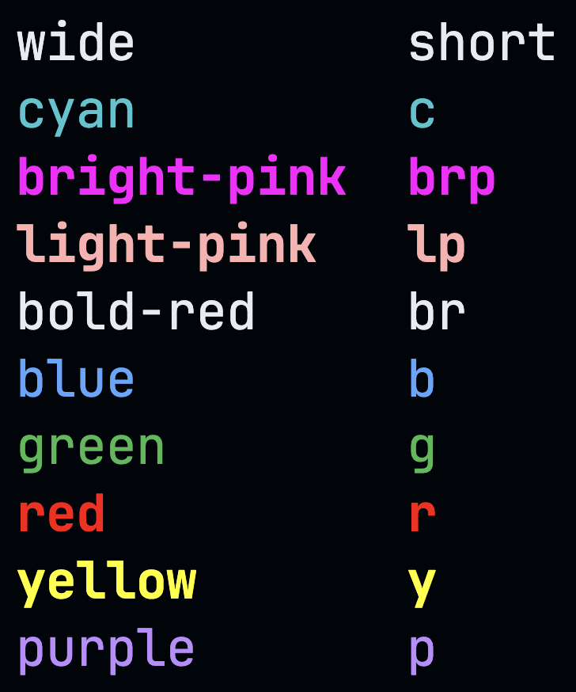

# Colored Text Printer

Colored Text Printer (ctp) is a small cli tool that allows you to print colored text into your console.

You can call this to print colored text
```sh
ctp print <some text to print> -c=<color-name>
```

Installation
```sh
go install github.com/webjaba/ctp
```

Example of usage:
```sh
ctp colors
```


```sh
ctp print colored text -c=r
```

